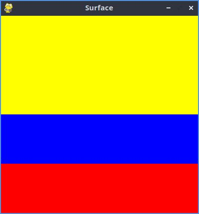

 # Estructura de un juego en Pygame

## Inicializacion

- Como todo programa en Phyton, se debe importar los módulos  librerias al utilizar 
`import pygame`

- Inicializacion pygame usando la función init (). Inicializando todos los módulos de pygame importados.
`pygame.init()`

##  Visualiacion de la ventana 

`ventana = pygame.display.set.mode((600, 400))`

- set_mode() es la función encargada de definir el tamaño de la ventana. en el ejemplo, se está definiendo una ventana de 600 px de ancho, por 400 px de alto.

`pygame.display.set_caption("Mi ventana")`

- set_caption() es la función que añade un titulo a la ventana.

 ### Función set_mode()

 `set_mode(size =(0,0,), flags = 0, depth = 0, display = 0)`

- size = (600,400) : define el tamaño de la ventana.

- flags: define uno o mas comportamientos para la ventana.
  - Valores:
     - pygame.FULLSCREEN
     - pygame.RESIZABLE
    - Ejemplo:
       - flags = pygame.FULLSCREEN | pygame.RESIZABLE: pantalla completa, dimensiones modificables.

### Bucle del juego - game loop
- Bucle infinito que se interrumpira el cumplir ciertos criterios.
- Reloj interno del juego
- En cada iteración del bucle del juego podemos mover a un personaje, o tener en cuenta que un objeto a alcanzar a otro, o que se ha cruzado la linea de llegada, lo que quiere decir que la partida ha terminado.
- Cada iteración es una oportunidad para actualizar todos los datos relacionados con el estado actual de la partida.
- En cada iteración se realizan las siguientes tareas: 
    1. Comparar que no se alcazan las condiciones de parada, en cuyo caso interrumpe el bucle.
    2. Actualizar los recursos necesarios para la interación actual.
    3. Obtener las entradas  del sistema, o de interacción con el jugador.
    4. Actualizar todas las entidades que caracterizan el juego.
    5. Refrescar pantalla.

  ## Superficies pygame
  - Superficie: 
       - Elemento geométrico.
       - Linea, polígono, imagen, texto que se muestra en la pantalla.
       - El polígono se puede o no rellenar de color.
       - Las superficies se crean de diferente manera dependiendo del tipo: 
          - imagen: image.load()
          - texto: font.render()
          - Superficie genérica: pygame.Surface()
          - Ventana del juego: pygame.display.set_mode().

### Bandera de Colombia
```Phyton 
#  importamos la libreria pygame
import pygame

# Inicializamos los modulos de pygame
pygame.init()

# Establecer titulo a la ventana 
pygame.display.set_caption("Surface")

# Establecemos las dimensiones de la ventana 
ventana = pygame.display.set_mode((400,400))

# definimos un color
amarillo = (255,255,0)
azul = (0,0,255)
rojo = (255,0,0)
color_aletorio = ((amarillo,azul,rojo))

# Creamos una superficie

color_amarillo = pygame.Surface((400,200))
color_azul = pygame.Surface((400,300))
color_rojo= pygame.Surface((400,100))

# Rellenamos la superficie de azul
color_amarillo.fill((amarillo))
color_azul.fill((azul))
color_rojo.fill((rojo))
# Inserto o muevo  la superficie en la ventana
ventana.blit(color_amarillo, (0,0))
ventana.blit(color_azul, (0,200))
ventana.blit(color_rojo, (0,300))

# Actualiza la visualización de la ventana
pygame.display.flip()

# Bucle del juego

while True: 
    event = pygame.event.wait()
    if event.type == pygame.QUIT:
        break

pygame.quit()
```


## Gestion del tiempo y los eventos

### Módulo time

- Ofrece varias funciones que permiten cronometrar la sesion actual (desde el init()) o pausar, la ejecucion, por ejemplo.
- Funciones:
   - pygame.time.get_ticks
   - pygame.time.waitpygame.time.delay

- Objeto Clock
   - La función tick permite actualizar el reloj asociado con el juego actual.
   - Se llama cada vez que se actualiza la pantalla del juego
   - Permite especificar el número máximo de fotogramas que se muestran por segundo, y no por tanto, limitar y contrlolar la velocidad de ejecución del juego.
   - Si insertamos en un bucle de juego la siguiente linea, garantizamos que nunca se ira mas rápido de 50 fotografos por segundo: `Clock.tick(50)`

### Gestion de eventos 
- Hay diferentes formas para que el programa sepa que se ha desencadenado un evento.
- Es esencial que los programas puedan conocer inmediatamente las acciones del jugador a través del teclado, el mouse, el joystick o cualquier otro periferico.

#### Funcion pygame.event.get
- Permite obtener todos los eventos en espera de ser procesados y que estan disponibles en una cola.
- Si no hay ninguno,entonces se obtiene un colccion vacia.
```Phyton
# Usamos  un bucle for para recorrer todos los eventos de la colección obtenida al llamar a la funcion get.
for event in pygame.event.get():
    if event.type == pygame.KEYDOWN:
       if event.key == pygame.K_ESCAPE:
         PARAR_JUEGO = true
```
### Función pygame.event.wait
- Esta funciń espera que ocurra un evento, y en cuanto sucede, está disponible.

```Phyton
while True: 
    event = pygame.event.wait()
    if event.type == pygame.QUIT:
        break
```

#### Funcion pygame.event.poll
- Devuelve solo uno de los puntos que estan en la cola de espera.


## Sonidos en Pygame
- pygame.mixer: Modulo que permite la gestion del sonido.
- music: Su modulo que gestiona la musica de fondo
- Sound: Objeto de mixer que se puede instanciar varias veces parfa usarlo en efectos de sonido del juego.

### Archivos de sonido
- Se recomienda usar dos formatos, principalmente:
  - Formato WAV (Waveform Audio File Format)
  - Formato abierto y gratuito OGG


### Channe (canal) en Pygame
- Un juego tiene varios canales de sonido.
- Se puede asignar un sonido al canal numero 1 y otro diferente al numero 2.
- Entonces es posible reproducir sonidos simultaneamente activando su lectura en diferentes canales.


## Sprits
- Objeto que asocia una ubicacion, una representacion grafica (Esta o aquella imagen, por ejemplo) y un conjunto de propiedades.
- Estas propiiedades pueden ser un nombre, un texto, valores booleanos que caractelizan el objeto en cuestion (por ejemplo si el objeto se puede mover o no)
- Una posible traduccion del termino sprite podria ser "imagen-objeto" que se actualiza con cada iteracion del bucle del juego.
- Cuanto mas complejo es el juego, mas objetos graficos tiene que gestionar y actualizar, lo que puede ser tedioso.
- Pygame usa no solo la nocion de sprite, sino la nocion de grupo de sprites (group)
- La nocion de group permite agrupar los objetos del mismo tipo. Ejemplo: todos los soldados de un ejercito, lo que se entiende como una coleccion de instancias de una clase Soldado
- Un determinado procesamiento se puede aplicar a un conjunto o subconjunto de sprites. Ejemplo: cambiar el color de todos los enemigos o hacer invisibles algunos objetos.